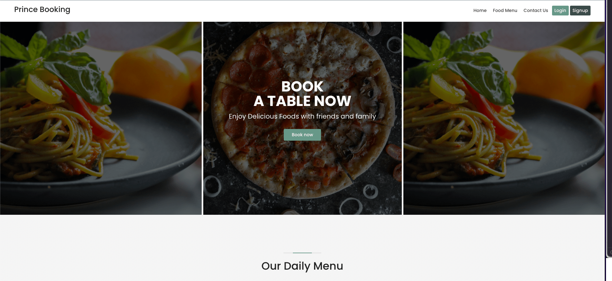
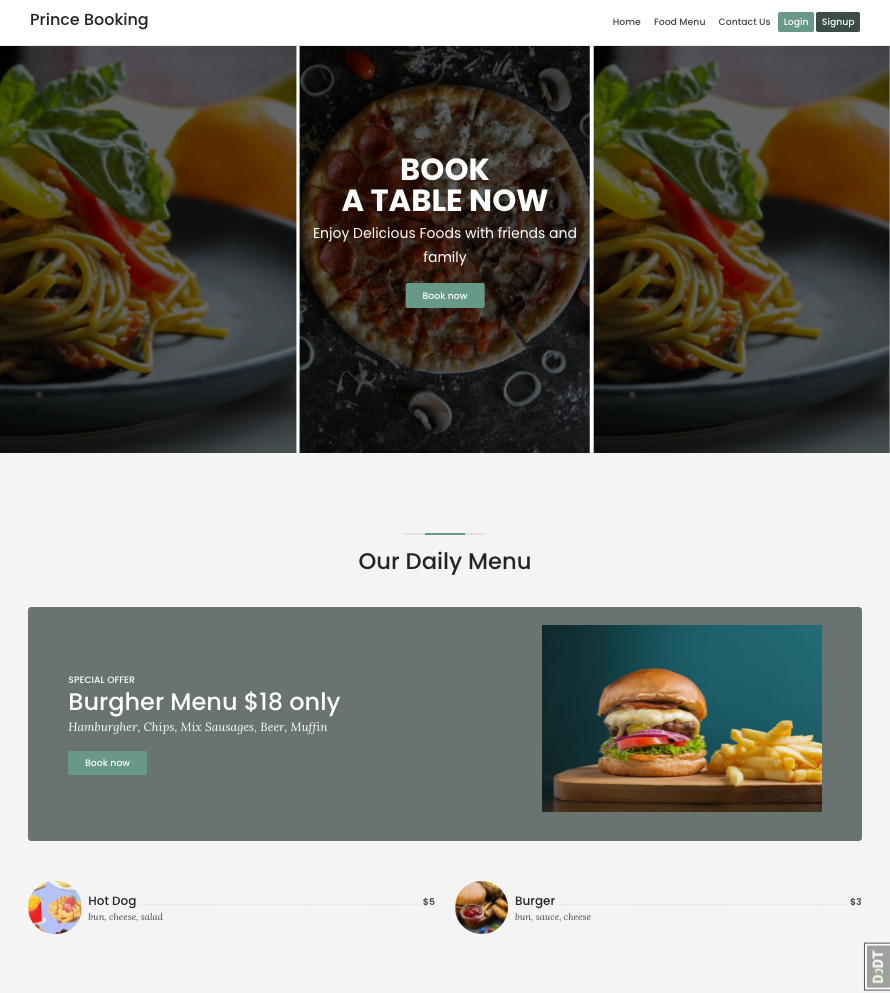
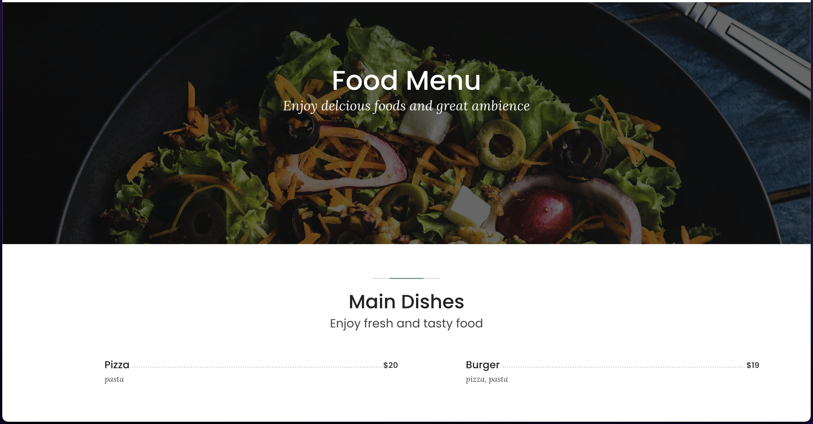
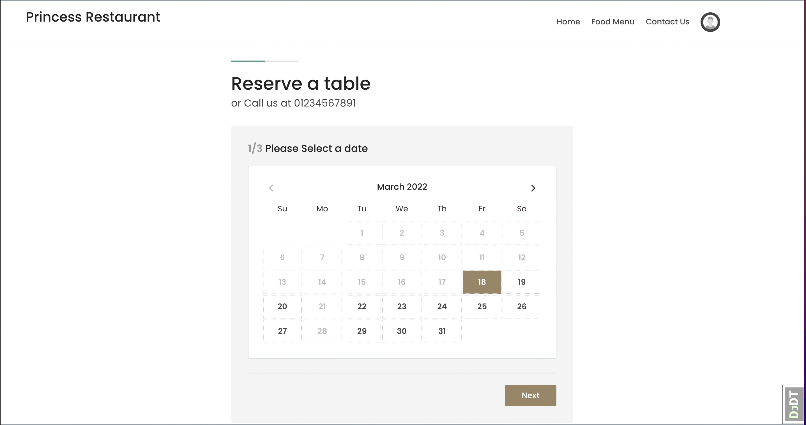

# **PrinceResturant - Restaurant Booking Application**

[Link to Live Project](#)

## Purpose

PrinceResturant is designed and developed to automate the booking system of the restaurant so that customer can book table online and the restaurant can grow their business.

PrinceResturant Application allows a small to medium size restaurant-business owner to extend their business to online and automate the reservation system. So that, people can know about the restaurant and see what's they are offering, besides they can also make reservations for them or their friends and family.

## Strategies

- Design and develop a reservation system to expand the restaurant business online.
- Construct a secure and comprehensive backend structure following the MVC design pattern.
- Include a SQL(relational) database to store restaurant data.
- Construct super-admin access on the system to allow make the required changes.
- Develop restaurant-admin access on the system to manage the restaurant and bookings.
- Enhance productivity and efficiency in the booking system to increase customer sales and customer retention.
- Simplify the reservation model to reduce manual work.
- Build user-friendly and intuitive UI that is responsive to ensure a better user experience.
- Handle errors in such a way that other developers can easily understand the issue.
- Allow customers to find out more information about all the services provided by the restaurant.
- Allow customers to contact the restaurant admin.
- Store contact information to the database.

## Database Schema

For this application we've used SQL database(SQLlite for development & PostgresDB for production) to store and access any associated data.

Following diagram shows the database models and the relationship between them.

## Wireframes

Following wireframes are used during the development process.

## Features & Details

A detailed breakdown of all the features of the PrinceRestaurant Booking Application.

### Home/index Page

*URL: `{host}` or `{host}/home`*

- A dynamic navbar with 'Home', 'Contact Us', 'Food Menu' and not authenticated('Login', 'Signup') nav links.
- If a user is authenticated and not admin, the nav menu changed to 'Home', 'Contact Us', 'Food Menu', avatar(User Reservations, Update Profile, Logout).
- If a user is authenticated and admin, nav menu changed to 'Home', 'Contact Us', 'Food Menu', avatar(Admin Dashboard, User Reservations, Update Profile, Logout).
- A hero section slider of food images with a 'Book now' action button.
- Ten items of food menu with thumbnails and price.
- Food menu thumbnails have a popup view upon click.
- A section with the 'Contact Us' call to action button.
- A Footer with some information about the restaurant.
- In a smaller display, all links will be contained in a hamburger dropdown icon.

    
Home (View Home page)

    

        
    

### Food Menu Page

*URL: `{host}/food-menu/all/`*

- Title section with parallax background.
- Contains offer section with 'Book Now' call to action button.
- Contains all the items on the food menu with thumbnails, ingredients, and prices.

    
Food Menu (View Food Menu page)

    

        
    

### Login Page

*URL: `{host}/accounts/login/`*

- Login form with required fields.
- Show messages on wrong credentials.
- Redirect to requested page after succesful login.
- Contains register button on the page.

    
Login Menu (View Login Menu page)

    

        
    

### Signup Page

*URL: `{host}/accounts/signup/`*

- Signup form with required fields.
- Show messages on wrong credentials or exists user.
- Redirect to profile update after succesful signup.
- Contains login link on the page.

    
Signup Menu (View Signup Menu page)

    

        
    

### Profile Update Page

> Login requied

*URL: `{host}/profile/update/`*

- Profile Update form with fields.
- User is able to add avater and more information.
- Show messages on wrong credentials.
- Redirect to profile update after succesful submission.

    
Profile Update Menu (View Profile Update Menu page)

    

        
    

### Make Reservation Page

> Login requied

*URL: `{host}/reservations/make_a_reservation/`*

- Contains date select widget form to select a reservation date.
- Show validation error if date is not selected.
- On next contains time and table-size select widget.
- On next contains short message widget and accept T&C field(requied).
- On successfull reservation user redirect to success page.
- User can not make duplicate reservation.
- On duplicate reservation, user redirect to the same page with error message.

    
Make Reservation (View Make Reservation page)

    

        
    

### User Reservation Page

> Login requied

*URL: `{host}/reservations/my-reservations/`*

- Contains all the successful reservations(upcoming) of the requested user.
- User can cancel their already made reservations.
- After successful cancellation user will be rediredted on the same page.
- If user has no reservation a "No reservation" message will be displayed on the page.

    
User Reservation (View User Reservation page)

    

        
    

### Contact Us Page

*URL: `{host}/contact/`*

- Contains contact information of the restaurant(comes from backend).
- User can send message by filling the form.
- After successful submission user will be redirected to the same page.

    
Contact Us (View Contact Us page)

    

        
    

